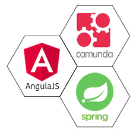

The current version of the PA JHipster is based on the JHipster 4.13.3 and the architecture of the web application generated is based on the following technology stack:

* Camunda (process engine)
* AngularJS (client-side)
* Spring Boot (server-side)

### Process Engine

* [Camunda](https://camunda.com/)

### Technology stack on the client side

*   [AngularJS v1.x](http://angularjs.org/)
*   Responsive Web Design with [Twitter Bootstrap](http://getbootstrap.com/)
*   [HTML5 Boilerplate](http://html5boilerplate.com/)
*   Compatible with IE11 and modern browsers
*   Full internationalization support
*   Optional [Sass](https://www.npmjs.com/package/node-sass) support for CSS design
*   Optional WebSocket support with Spring Websocket

With the great development workflow:

*   Easy installation of new JavaScript libraries with [Bower](http://bower.io/)
*   Build, optimization and live reload with [Gulp.js](http://www.gulpjs.com)
*   Testing with [Karma](http://karma-runner.github.io/), [Headless Chrome](https://github.com/GoogleChrome/puppeteer) and [Protractor](http://www.protractortest.org)

And what if a single Web page application isn't enough for your needs?

*   Support for the [Thymeleaf](http://www.thymeleaf.org/) template engine, to generate Web pages on the server side

### Technology stack on the server side

A complete [Spring application](http://spring.io/):

*   [Spring Boot](http://projects.spring.io/spring-boot/) for easy application configuration
*   [Maven](http://maven.apache.org/) or [Gradle](http://www.gradle.org/) configuration for building, testing and running the application
*   ["development" and "production" profiles]({{ site.url }}/profiles/) (both for Maven and Gradle)
*   [Spring Security](http://docs.spring.io/spring-security/site/index.html)
*   [Spring MVC REST](http://spring.io/guides/gs/rest-service/) + [Jackson](https://github.com/FasterXML/jackson)
*   Optional WebSocket support with Spring Websocket
*   [Spring Data JPA](http://projects.spring.io/spring-data-jpa/) + Bean Validation
*   Database updates with [Liquibase](http://www.liquibase.org/)
*   [Elasticsearch](https://github.com/elastic/elasticsearch) support if you want to have search capabilities on top of your database
*   [MongoDB](http://www.mongodb.org) and [Couchbase](https://www.couchbase.com) support if you'd rather use a document-oriented NoSQL database instead of JPA
*   [Cassandra](http://cassandra.apache.org/) support if you'd rather use a column-oriented NoSQL database instead of JPA
*   [Kafka](http://kafka.apache.org/) support if you want to use a publish-subscribe messaging system

### Ready to go into production:

*   Monitoring with [Metrics](http://metrics.dropwizard.io/) and [the ELK Stack](https://www.elastic.co/products)
*   Caching with [ehcache](http://ehcache.org/) (local cache), [hazelcast](http://www.hazelcast.com/) or [Infinispan](http://infinispan.org/)
*   Optimized static resources (gzip filter, HTTP cache headers)
*   Log management with [Logback](http://logback.qos.ch/), configurable at runtime
*   Connection pooling with [HikariCP](https://github.com/brettwooldridge/HikariCP) for optimum performance
*   Builds a standard WAR file or an executable JAR file
*   Full Docker and Docker Compose support
*   Support for all major cloud providers: AWS, Cloud Foundry, Heroku, Kubernetes, OpenShift, Docker...